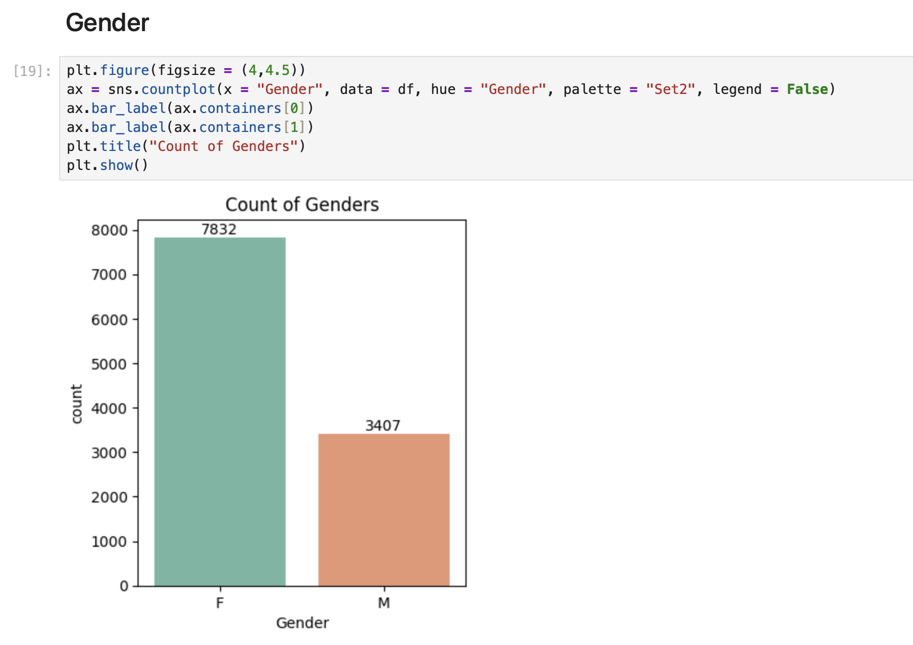

# Diwali-Sales-Analysis
# 🪔 Diwali Sales Analysis | Python Data Analytics Project

## 📌 Project Overview

This project analyzes Diwali sales data to understand customer purchasing behavior, identify high-value segments, and generate actionable business insights using Python.

---

## 🎯 Objective

* Analyze customer demographics and buying patterns
* Identify top-performing customer segments
* Discover high-revenue product categories
* Provide business recommendations to improve sales

---

## 🛠️ Tools & Technologies

* Python (Pandas, NumPy)
* Data Visualization (Matplotlib, Seaborn)
* Jupyter Notebook

---

## 🧹 Data Cleaning

**Before Cleaning:**

* Missing values in key columns
* Incorrect data types
* Irrelevant columns present

**After Cleaning:**

* Removed null values
* Converted data types (Amount → numeric)
* Dropped unnecessary columns
* Standardized categorical data

## 📊 Gender-wise Sales Distribution

### 🔍 Insight
- Female customers (7832) significantly outnumber male customers (3407)
- Females contribute ~70% of total customers
- Indicates strong female dominance in purchasing behavior during Diwali sales

### 💡 Business Impact
- Focus marketing campaigns on female customers
- Design targeted festive offers for women
- Optimize product categories preferred by female buyers

---------------------------------------

## 📊 Key Insights

* 👩 Female customers contribute more to total sales
* 🎯 Age group 26–35 is the highest spending segment
* 💍 Married customers spend more than unmarried
* 🌍 Certain states drive majority of revenue
* 💼 IT, Healthcare & Aviation professionals are top buyers
* 🛍️ Top categories: Food, Clothing, Electronics

---

## 📈 Advanced Insights

* High-value customers = Married females (Age 26–35)
* Strong relationship between age and spending behavior
* Occupation significantly impacts purchasing power
* Regional clusters show consistent high demand

---

## 💡 Business Recommendations

* Target females (26–35) with personalized campaigns
* Focus marketing on high-performing states
* Offer festive discounts for married customers
* Promote top categories with combo deals
* Use occupation-based targeting for premium products
* Introduce loyalty programs for repeat customers

---

## 📌 Conclusion

This project demonstrates end-to-end data analysis including data cleaning, visualization, and business insight generation. It reflects practical skills required for a Data Analyst role.

---

## 🚀 Author

**Karan**
Aspiring Data Analyst

---
[📄 View Full Project Report](./Diwali_Sales_Advanced_Project.pdf)
